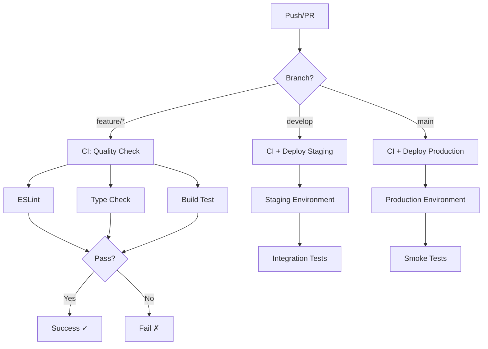

# 🎨 Nodo Studio - Landing Page

<div align="center">


**Landing page oficial de Nodo Studio - Creando experiencias digitales excepcionales**

[🌐 Ver Demo](https://landing-nodostudio.vercel.app) • [📖 Docs](#) • [🐛 Reportar Bug](https://github.com/Nodo-Studio/LANDING_NODOSTUDIO/issues) • [✨ Nueva Feature](https://github.com/Nodo-Studio/LANDING_NODOSTUDIO/issues)

</div>

---

## 📋 Tabla de Contenidos

- [Acerca del Proyecto](#-acerca-del-proyecto)
- [Tecnologías](#️-tecnologías)
- [Características](#-características)
- [Instalación](#-instalación)
- [Scripts Disponibles](#-scripts-disponibles)
- [Estructura del Proyecto](#-estructura-del-proyecto)
- [CI/CD Pipeline](#-cicd-pipeline)
- [Despliegue](#-despliegue)
- [Guía de Desarrollo](#-guía-de-desarrollo)
- [Variables de Entorno](#-variables-de-entorno)
- [Contribución](#-contribución)
- [Licencia](#-licencia)
- [Contacto](#-contacto)

---

## 🚀 Acerca del Proyecto

Landing page moderna y profesional de Nodo Studio, diseñada para mostrar nuestros servicios, proyectos y valores como estudio creativo digital. Construida con las últimas tecnologías web para garantizar rendimiento, escalabilidad y una experiencia de usuario excepcional.

### ✨ Highlights

- ⚡ **Ultra Rápido**: Tiempos de carga < 2 segundos gracias a Vite
- 🎯 **100% Responsivo**: Diseño adaptable desde mobile hasta desktop
- 🔒 **Type-Safe**: TypeScript para código robusto y mantenible
- ♿ **Accesible**: Cumplimiento de estándares WCAG 2.1
- 🎨 **Diseño Moderno**: UI/UX profesional y atractiva
- 🔍 **SEO Optimizado**: Meta tags y estructura semántica
- 🚀 **Deploy Automático**: CI/CD con GitHub Actions

---

## 🛠️ Tecnologías

### Core Stack

| Tecnología | Versión | Descripción |
|-----------|---------|-------------|
| [React](https://react.dev/) | 18.x | Biblioteca UI moderna con Hooks |
| [TypeScript](https://www.typescriptlang.org/) | 5.x | Superset de JavaScript con tipado |
| [Vite](https://vitejs.dev/) | 5.x | Build tool de próxima generación |

### Herramientas de Desarrollo

- **ESLint** - Análisis estático de código
- **@vitejs/plugin-react** - Fast Refresh con Babel/SWC
- **TypeScript ESLint** - Reglas específicas para TS
- **PostCSS** - Transformación de CSS (si aplica)
- **Prettier** - Formateo de código consistente

### DevOps

- **GitHub Actions** - CI/CD automatizado
- **Vercel/Netlify** - Hosting y deploy
- **Git** - Control de versiones

---

## 🎯 Características

### Funcionalidades Principales

✅ **Landing Page Dinámica**
- Hero section impactante
- Animaciones suaves y modernas
- Lazy loading de componentes

✅ **Secciones Completas**
- Servicios ofrecidos
- Portfolio de proyectos
- Equipo de trabajo
- Testimonios de clientes
- Formulario de contacto funcional

✅ **Optimizaciones**
- Code splitting automático
- Compresión de assets
- Caché inteligente
- Imágenes optimizadas

✅ **SEO & Performance**
- Meta tags dinámicos
- Open Graph para redes sociales
- Sitemap XML
- Lighthouse score > 90

---

## 📦 Instalación

### Prerrequisitos

Asegúrate de tener instalado:

```bash
node --version  # v18.x o superior
npm --version   # v9.x o superior
git --version   # v2.x o superior
```

### Pasos de Instalación

1. **Clona el repositorio**

```bash
git clone https://github.com/Nodo-Studio/LANDING_NODOSTUDIO.git
cd LANDING_NODOSTUDIO
```

2. **Instala las dependencias**

```bash
npm install
```

O con tu gestor de paquetes preferido:

```bash
yarn install
# o
pnpm install
```

3. **Configura las variables de entorno**

```bash
cp .env.example .env.local
```

Edita `.env.local` con tus configuraciones (ver sección [Variables de Entorno](#-variables-de-entorno))

4. **Inicia el servidor de desarrollo**

```bash
npm run dev
```

Abre [http://localhost:5173](http://localhost:5173) en tu navegador 🎉

---

## 📜 Scripts Disponibles

```bash
# 🚀 Desarrollo
npm run dev          # Inicia servidor de desarrollo con HMR
npm run dev:host     # Dev server accesible desde red local

# 🏗️ Build
npm run build        # Genera build optimizado para producción
npm run build:analyze # Build con análisis de bundle size

# 👀 Preview
npm run preview      # Previsualiza build de producción

# 🔍 Calidad de Código
npm run lint         # Ejecuta ESLint
npm run lint:fix     # Corrige problemas de linting automáticamente
npm run type-check   # Verifica tipos de TypeScript

# 🧹 Limpieza
npm run clean        # Limpia directorios de build
```

---

## 📁 Estructura del Proyecto

```
LANDING_NODOSTUDIO/
│
├── .github/
│   └── workflows/
│       ├── ci.yml              # Pipeline de integración continua
│       └── cd.yml              # Pipeline de despliegue continuo
│
├── public/                     # Archivos estáticos (no procesados)
│   ├── favicon.ico
│   ├── robots.txt
│   └── sitemap.xml
│
├── src/
│   ├── assets/                 # Assets procesados por Vite
│   │   ├── images/
│   │   ├── icons/
│   │   └── fonts/
│   │
│   ├── components/             # Componentes React
│   │   ├── common/            # Componentes reutilizables
│   │   │   ├── Button/
│   │   │   ├── Card/
│   │   │   └── Input/
│   │   ├── layout/            # Layout components
│   │   │   ├── Header/
│   │   │   ├── Footer/
│   │   │   └── Navigation/
│   │   └── sections/          # Secciones de la landing
│   │       ├── Hero/
│   │       ├── Services/
│   │       ├── Portfolio/
│   │       ├── Team/
│   │       └── Contact/
│   │
│   ├── hooks/                  # Custom React hooks
│   │   ├── useIntersection.ts
│   │   ├── useScrollPosition.ts
│   │   └── useMediaQuery.ts
│   │
│   ├── styles/                 # Estilos globales
│   │   ├── globals.css
│   │   ├── variables.css
│   │   └── animations.css
│   │
│   ├── types/                  # Tipos TypeScript
│   │   ├── index.ts
│   │   └── api.ts
│   │
│   ├── utils/                  # Funciones utilitarias
│   │   ├── helpers.ts
│   │   ├── constants.ts
│   │   └── validators.ts
│   │
│   ├── App.tsx                 # Componente raíz
│   ├── main.tsx                # Entry point
│   └── vite-env.d.ts          # Tipos de Vite
│
├── .env.example                # Ejemplo de variables de entorno
├── .eslintrc.cjs              # Configuración ESLint
├── .gitignore                  # Archivos ignorados por Git
├── index.html                  # HTML template
├── package.json                # Dependencias y scripts
├── tsconfig.json              # Config TypeScript principal
├── tsconfig.app.json          # Config TS para la aplicación
├── tsconfig.node.json         # Config TS para Node
├── vite.config.ts             # Configuración de Vite
└── README.md                   # Este archivo
```

---

## 🔄 CI/CD Pipeline

### Arquitectura del Pipeline



### 1. Continuous Integration (CI)

**Triggers:** Push y Pull Request a cualquier rama

```yaml
name: CI Pipeline

on: [push, pull_request]

jobs:
  quality-check:
    runs-on: ubuntu-latest
    
    steps:
      - name: Checkout Code
        uses: actions/checkout@v4
        
      - name: Setup Node.js
        uses: actions/setup-node@v4
        with:
          node-version: '18'
          cache: 'npm'
          
      - name: Install Dependencies
        run: npm ci
        
      - name: Run ESLint
        run: npm run lint
        
      - name: TypeScript Type Check
        run: npm run type-check
        
      - name: Build Application
        run: npm run build
        
      - name: Upload Build Artifacts
        uses: actions/upload-artifact@v3
        with:
          name: dist
          path: dist/
```

**Checks realizados:**
- ✅ Análisis de código estático (ESLint)
- ✅ Verificación de tipos (TypeScript)
- ✅ Build de prueba
- ✅ Tests unitarios (si aplica)
- ✅ Análisis de bundle size
- ✅ Verificación de vulnerabilidades de seguridad

### 2. Continuous Deployment (CD)

**Triggers:** Push a `main` o `develop`

```yaml
name: CD Pipeline

on:
  push:
    branches:
      - main
      - develop

jobs:
  deploy:
    runs-on: ubuntu-latest
    needs: quality-check
    
    steps:
      - name: Checkout Code
        uses: actions/checkout@v4
        
      - name: Setup Node.js
        uses: actions/setup-node@v4
        with:
          node-version: '18'
          
      - name: Install Dependencies
        run: npm ci
        
      - name: Build for Production
        run: npm run build
        env:
          VITE_API_URL: ${{ secrets.VITE_API_URL }}
          
      - name: Deploy to Vercel
        uses: amondnet/vercel-action@v25
        with:
          vercel-token: ${{ secrets.VERCEL_TOKEN }}
          vercel-org-id: ${{ secrets.ORG_ID }}
          vercel-project-id: ${{ secrets.PROJECT_ID }}
          vercel-args: '--prod'
          
      - name: Notify Deployment
        uses: 8398a7/action-slack@v3
        with:
          status: ${{ job.status }}
          webhook_url: ${{ secrets.SLACK_WEBHOOK }}
```

### Entornos de Despliegue

| Entorno | Rama | URL | Propósito |
|---------|------|-----|-----------|
| 🟢 **Production** | `main` | https://nodostudio.com | Producción pública |
| 🟡 **Staging** | `develop` | https://staging.nodostudio.com | Testing pre-producción |
| 🔵 **Preview** | `PR-*` | https://pr-123.nodostudio.com | Revisión de PRs |

### Variables de CI/CD

Configuradas en GitHub Secrets:

```bash
# API Configuration
VITE_API_URL=https://api.nodostudio.com

# Deployment
VERCEL_TOKEN=your_vercel_token
VERCEL_ORG_ID=your_org_id
VERCEL_PROJECT_ID=your_project_id

# Notifications
SLACK_WEBHOOK=your_slack_webhook_url
```

### Badges de Estado


---

## 🚀 Despliegue

### Opción 1: Vercel (Recomendado)

**Deploy Automático:**

1. Conecta tu repositorio a Vercel
2. Configura las variables de entorno
3. Cada push a `main` desplegará automáticamente

**Deploy Manual:**

```bash
# Instalar Vercel CLI
npm i -g vercel

# Login
vercel login

# Deploy a producción
vercel --prod
```

### Opción 2: Netlify

```bash
# Instalar Netlify CLI
npm install -g netlify-cli

# Login
netlify login

# Build y deploy
npm run build
netlify deploy --prod --dir=dist
```

### Opción 3: Deploy Manual

```bash
# Generar build de producción
npm run build

# Los archivos optimizados estarán en /dist
# Subir contenido de /dist a tu servidor web
```

### Configuración de Servidor (nginx)

```nginx
server {
    listen 80;
    server_name nodostudio.com;
    root /var/www/nodostudio/dist;
    
    location / {
        try_files $uri $uri/ /index.html;
    }
    
    # Cache estático
    location ~* \.(js|css|png|jpg|jpeg|gif|ico|svg)$ {
        expires 1y;
        add_header Cache-Control "public, immutable";
    }
}
```

---

## 💻 Guía de Desarrollo

### Configuración del Editor (VS Code)

**Extensiones recomendadas:**

```json
{
  "recommendations": [
    "dbaeumer.vscode-eslint",
    "esbenp.prettier-vscode",
    "bradlc.vscode-tailwindcss",
    "dsznajder.es7-react-js-snippets",
    "styled-components.vscode-styled-components"
  ]
}
```

**Configuración de workspace (`.vscode/settings.json`):**

```json
{
  "editor.formatOnSave": true,
  "editor.defaultFormatter": "esbenp.prettier-vscode",
  "editor.codeActionsOnSave": {
    "source.fixAll.eslint": true
  },
  "typescript.tsdk": "node_modules/typescript/lib"
}
```

### Convenciones de Código

**Naming Conventions:**

```typescript
// Variables y funciones: camelCase
const userName = "John";
function getUserData() {}

// Componentes: PascalCase
function UserProfile() {}

// Constantes: UPPER_SNAKE_CASE
const API_BASE_URL = "https://api.example.com";

// Tipos e Interfaces: PascalCase
interface UserData {}
type ButtonProps = {};
```

**Estructura de Componentes:**

```typescript
// Component.tsx
import { FC } from 'react';
import './Component.css';

interface ComponentProps {
  title: string;
  isActive?: boolean;
}

export const Component: FC<ComponentProps> = ({ title, isActive = false }) => {
  return (
    <div className="component">
      <h2>{title}</h2>
    </div>
  );
};
```

### ESLint Configuración Avanzada

Para producción, habilita type-aware lint rules:

```typescript
// eslint.config.js
import tseslint from 'typescript-eslint';

export default tseslint.config([
  {
    ignores: ['dist', 'node_modules']
  },
  {
    files: ['**/*.{ts,tsx}'],
    extends: [
      ...tseslint.configs.recommendedTypeChecked,
      ...tseslint.configs.strictTypeChecked,
    ],
    languageOptions: {
      parserOptions: {
        project: ['./tsconfig.json', './tsconfig.node.json'],
        tsconfigRootDir: import.meta.dirname,
      },
    },
  },
]);
```

### Git Workflow

**Branch Strategy:**

```
main (production)
  └── develop (staging)
      ├── feature/nueva-funcionalidad
      ├── fix/correccion-bug
      └── hotfix/fix-critico
```

**Commits Convencionales:**

```bash
feat: nueva característica
fix: corrección de bug
docs: cambios en documentación
style: formateo, punto y coma, etc
refactor: refactorización de código
test: añadir tests
chore: tareas de mantenimiento
```

**Ejemplo de workflow:**

```bash
# 1. Crear nueva rama
git checkout -b feature/contact-form

# 2. Hacer cambios y commits
git add .
git commit -m "feat: add contact form validation"

# 3. Push y crear PR
git push origin feature/contact-form

# 4. Después de aprobación, merge a develop
git checkout develop
git merge feature/contact-form

# 5. Deploy a staging automático

# 6. Cuando esté listo, merge a main
git checkout main
git merge develop

# 7. Deploy a producción automático
```

---

## 🔐 Variables de Entorno

### Configuración Local

Crea un archivo `.env.local`:

```bash
# API Configuration
VITE_API_URL=http://localhost:3000/api
VITE_API_KEY=tu_api_key_local

# App Configuration
VITE_APP_NAME=Nodo Studio
VITE_APP_URL=http://localhost:5173

# Analytics (opcional)
VITE_GA_ID=G-XXXXXXXXXX

# Feature Flags
VITE_ENABLE_ANALYTICS=false
VITE_ENABLE_CONTACT_FORM=true
```

### Variables de Producción

Configura en tu plataforma de hosting:

```bash
# Vercel/Netlify Dashboard
VITE_API_URL=https://api.nodostudio.com
VITE_API_KEY=prod_api_key_secure
VITE_APP_URL=https://nodostudio.com
VITE_GA_ID=G-PROD123456
VITE_ENABLE_ANALYTICS=true
```

### Acceso en el Código

```typescript
// utils/config.ts
export const config = {
  apiUrl: import.meta.env.VITE_API_URL,
  apiKey: import.meta.env.VITE_API_KEY,
  appName: import.meta.env.VITE_APP_NAME,
  isProduction: import.meta.env.PROD,
  isDevelopment: import.meta.env.DEV,
};
```

---

## 🤝 Contribución

¡Las contribuciones son bienvenidas! Este proyecto sigue el [Contributor Covenant](https://www.contributor-covenant.org/) Code of Conduct.

### Cómo Contribuir

1. **Fork** el proyecto
2. **Crea** tu rama de feature (`git checkout -b feature/AmazingFeature`)
3. **Commit** tus cambios (`git commit -m 'feat: add amazing feature'`)
4. **Push** a la rama (`git push origin feature/AmazingFeature`)
5. **Abre** un Pull Request

### Guías

- ✅ Sigue las convenciones de código del proyecto
- ✅ Asegúrate que todos los tests pasen
- ✅ Actualiza la documentación si es necesario
- ✅ Usa commits convencionales
- ✅ Añade tests para nuevas funcionalidades
- ✅ Mantén el código limpio y legible

### Reportar Bugs

Si encuentras un bug, por favor abre un issue incluyendo:

- Descripción clara del problema
- Pasos para reproducir
- Comportamiento esperado vs actual
- Screenshots si aplica
- Información del entorno (OS, Browser, etc)

---

## 📄 Licencia

Este proyecto está bajo la Licencia MIT. Ver el archivo [LICENSE](LICENSE) para más detalles.

```
MIT License

Copyright (c) 2024 Nodo Studio

Permission is hereby granted, free of charge, to any person obtaining a copy
of this software and associated documentation files (the "Software"), to deal
in the Software without restriction...
```

---

## 📞 Contacto

**Nodo Studio** - Creando experiencias digitales excepcionales

- 🌐 Website: [www.nodostudio.com](https://www.nodostudio.com)
- 📧 Email: dev.nodostudio@gmail.com
- 📷 Instagram: [@nodo.studio](https://www.instagram.com/nodostudio.d/)

**Project Link:** [https://github.com/Nodo-Studio/LANDING_NODOSTUDIO](https://github.com/Nodo-Studio/LANDING_NODOSTUDIO)

**Live Demo:** [https://nodostudio.com](https://nodostudio.com)

---

## 🙏 Agradecimientos

Agradecimientos especiales a:

- [React Team](https://react.dev/) por la increíble biblioteca
- [Vite Team](https://vitejs.dev/) por el build tool más rápido
- [TypeScript Team](https://www.typescriptlang.org/) por hacer JavaScript mejor
- [Vercel](https://vercel.com/) por el hosting y CI/CD
- Todos los [contribuidores](https://github.com/Nodo-Studio/LANDING_NODOSTUDIO/graphs/contributors) del proyecto

---

## 📊 Estadísticas del Proyecto


---

<div align="center">

**⭐ Si este proyecto te resultó útil, considera darle una estrella ⭐**

**Hecho con ❤️ por el equipo de [Nodo Studio](https://github.com/Nodo-Studio)**

[⬆ Volver arriba](#-nodo-studio---landing-page)

</div>
